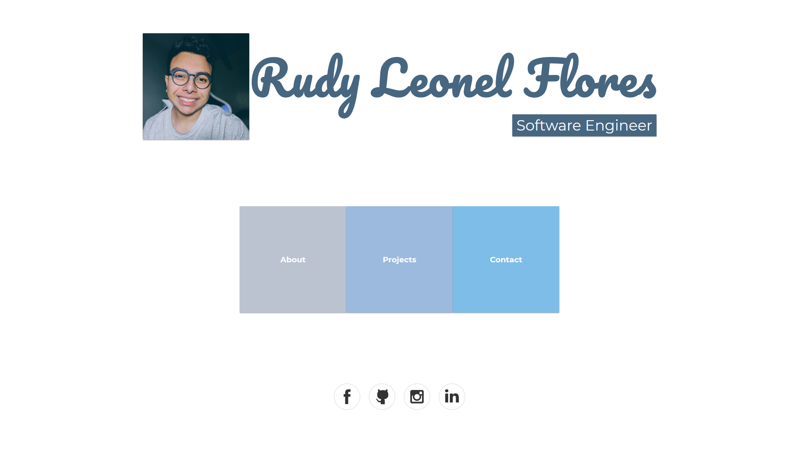
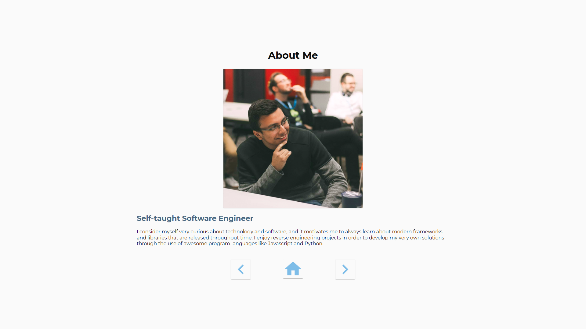
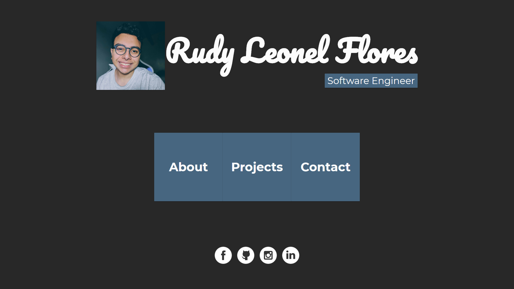
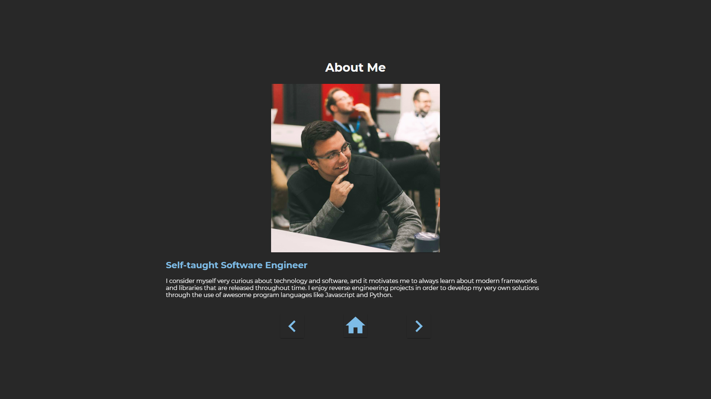

# Personal Website Version 4.0

A vanilla HTML/CSS/JS website with stunning material design 2.0 features, responsive UI all around, and dark mode!

## Main Features

- Component based design for easier upgrading and future scalability
- Material Design 2.0 features
- Responsive UI for all platforms!
- A dark mode that will not burn your eyes 😉

## Light mode 🔆

## Dark mode 🌙

## Check the website out here
https://rudypflores.github.io/personal-website/
